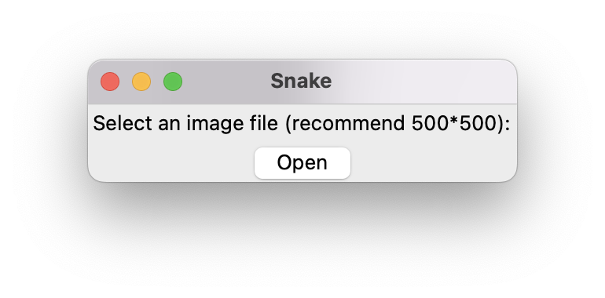
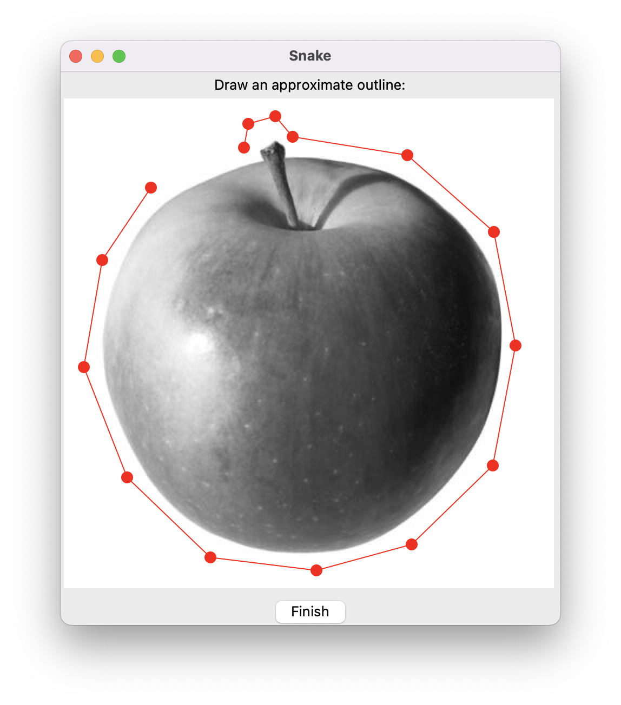
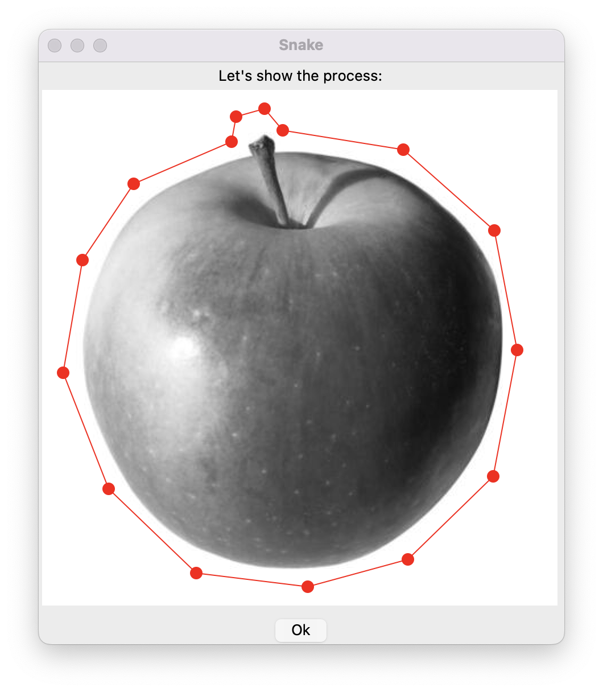

# Active Contour Model

The introduction can be found [here](ko5cles.github.io/CV).

## How to use

Download the folder. Make sure that python3 is installed.

Then, in the folder, run the following commands:

```
pip install -r requirements.txt
python3 main.py
```
Then, the program will prompt for an image:



After selecting an image, the program will prompt for an approximate contour:



After drawing, click "Finish". The program will do some preprocessing and then prompt for demonstration. Click 'OK'.


